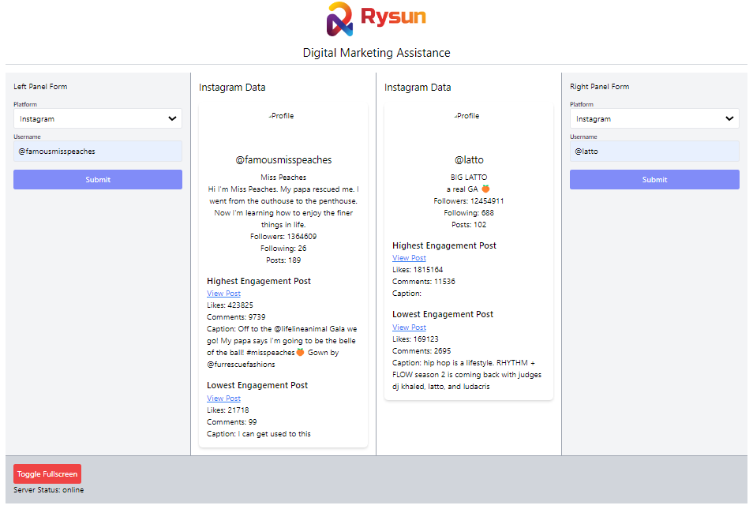

# Project Documentation

## Table of Contents
1. [Introduction](#introduction)
2. [Project Structure](#project-structure)
3. [Installation](#installation)
4. [HTML Files](#files)
    - [Frontend](#frontendindexhtml)
    - [Backend](#backendapppy)
5. [Deployment](#deployment)
6. [Contact Information](#contact-information)
7. [Todo](#todo)



Note: This is just the current state of the website before the handoff.

## Introduction
- This is a Rysun Digital Marketing website
- The basic idea of this website is to allow companies to compare their analytics on certain social medias to analytics of other companies on different social media platforms
  - Example: sephora wants to compare their instagram analytics with ultas instagram
  - The user will input both username handles, the platform, and then run the program
  - The program will then return the analytics of both companies on the specified platform and display in a side by side comparison screen

## Project Structure
- The project uses a python flask backend api. The frontend uses react js, html, and tailwind css.
- The backend is in `/project/backend`
- The frontend is in `/project/frontend`
- You can access the venv at `/.venv/`
- Tests are located in `/project/tests/`

  
## Installation
Use the package manager [pip](https://pip.pypa.io/en/stable/) to install the requirements

```bash
pip install -r requirements.txt
```

## Files

### frontend/index.html
- All of the html is located here
- All of the react js is located here
- All of the css is located here
#### Essentially, all of the frontend is located here
  
### backend/app.py
- Main entry point for the Python backend
- Used as the api for the entire system

## Deployment
- No `.env` variables as of now
- Process of deployment:
1. Host the frontend on a server
2. Host the backend on a seperate server

Note: that the urls must be configured correctly in `index.html` so that it sends requests to the proper `app.py`


## Contact Information
- You can contact omkar.patel@rysun.com if you have any questions

## Todo
- [ ] Complete the instagram platform
   - Fix how the instagram data is stored in the database
   - Fix how the instagram data is retrieved from the database
   - Try to iframe or preview some things such as pfp, top/lowest post, etc... you can view some attempts in `/frontend/instagram_iframe/` with files such as `/left/highest_engagement.html/` for iframes
- [ ] Add additional platforms
- [ ] Clean up GUI
- [ ] Update session manager
- [ ] Integrate propper database
- [ ] Add system to automatically update data over some interval